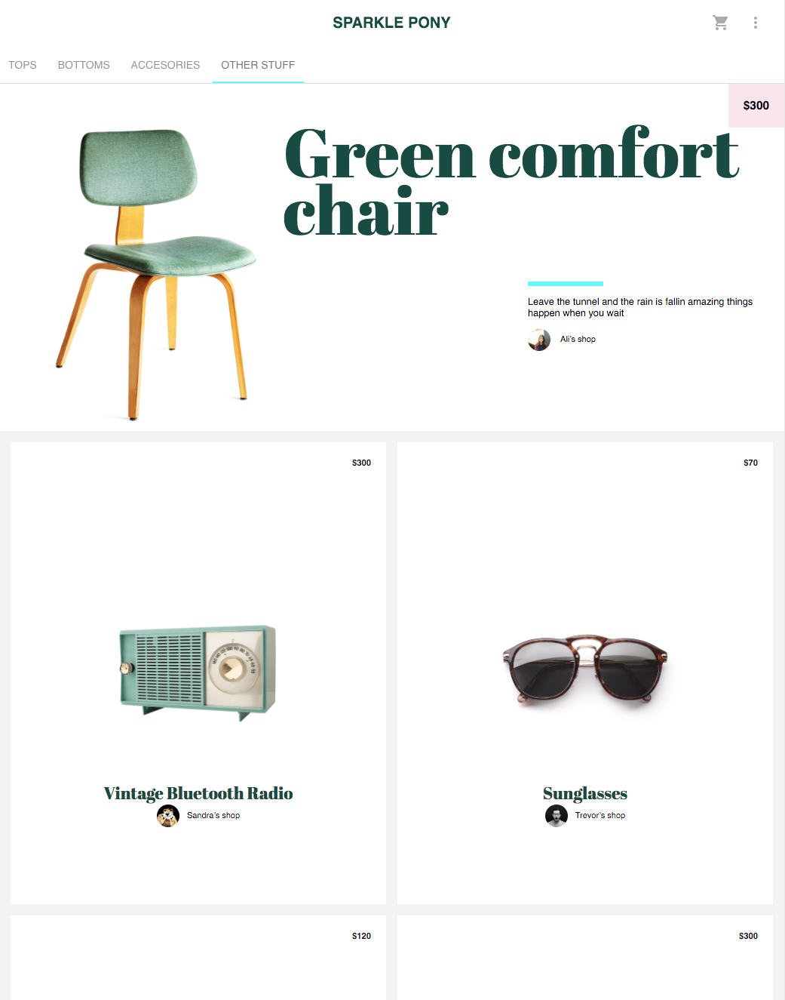

# \<sparklepony\>



[Live Preview](TODO)

A shopping application built with experimental technologies. Featuring a 
Web Components / Polymer front-end and a Go / gRPC over HTTP back-end.

## Getting started

To start the front-end
```
cd client
polymer serve
```

To start the back-end
```
cd server
go run grpc/main.go
```
and in a separate shell
```
cd server
go run http/main.go
```
